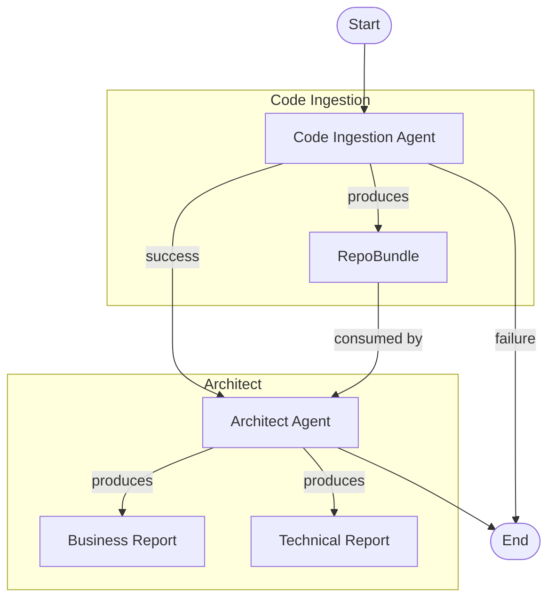

# Code Comprehension Agentic AI Solution

A Python POC project demonstrating a multi-agent code comprehension solution using **LangGraph** and **LangChain**.

## 🎯 Overview

This project implements two specialized AI agents orchestrated via LangGraph:

1. **Code Ingestion Agent** - Ingests GitHub repositories and produces structured knowledge bundles
2. **Architect Agent** - Generates Business and Technical Comprehension reports

## 🏗️ Architecture



---

## 📋 Developer Setup Guide

### Prerequisites

- Python 3.11+
- Git
- GitHub Personal Access Token
- OpenAI API Key (or Azure OpenAI / Anthropic)

### Step 1: Clone Repository

```powershell
git clone https://github.com/your-org/agenticai-capstone-sdlc.git
cd agenticai-capstone-sdlc
```

### Step 2: Create Virtual Environment

```powershell
# Windows
python -m venv .venv
.\.venv\Scripts\Activate.ps1

# Linux/macOS
python -m venv .venv
source .venv/bin/activate
```

### Step 3: Install Dependencies

```powershell
pip install -r requirements.txt
```

### Step 4: Configure Environment Variables

```powershell
# Copy template
Copy-Item .env.example .env
```

Edit `.env` with your credentials:

```env
# =============================================================================
# LLM Provider (choose one: openai, azure_openai, anthropic)
# =============================================================================
LLM_PROVIDER=openai

# OpenAI
OPENAI_API_KEY=sk-your-openai-api-key-here
OPENAI_MODEL=gpt-4o

# Azure OpenAI (alternative)
# AZURE_OPENAI_ENDPOINT=https://your-resource.openai.azure.com/
# AZURE_OPENAI_API_KEY=your-key
# AZURE_OPENAI_DEPLOYMENT=gpt-4o

# =============================================================================
# GitHub (required for repository access)
# =============================================================================
GITHUB_TOKEN=ghp_your-github-token-here

# =============================================================================
# LangSmith Tracing (optional but recommended)
# =============================================================================
LANGCHAIN_TRACING_V2=true
LANGCHAIN_API_KEY=ls__your-langsmith-key
LANGCHAIN_PROJECT=code-comprehension
```

### Step 5: Verify Setup

```powershell
# Check Python version
python --version  # Should be 3.11+

# Verify imports work
python -c "from src import create_comprehension_graph; print('✅ Setup complete!')"
```

---

## 🚀 Running the Application

### Option 1: REST API (Recommended)

Start the API server:

```powershell
# Using helper script
.\start_api.ps1

# Or manually
python -m uvicorn src.api:app --host 0.0.0.0 --port 8000 --reload
```

The API will be available at:
- **Base URL:** http://localhost:8000
- **Swagger UI:** http://localhost:8000/docs
- **ReDoc:** http://localhost:8000/redoc

### Option 2: Command Line

```powershell
# Basic usage
python -m src.main https://github.com/microsoft/vscode

# With options
python -m src.main https://github.com/owner/repo --ref develop --output reports/
```

---

## 📡 REST API Reference

### Base URL
```
http://localhost:8000
```

### Endpoints

| Method | Endpoint | Description |
|--------|----------|-------------|
| `GET` | `/health` | Health check |
| `POST` | `/analyze` | Start async analysis |
| `GET` | `/analyze/{job_id}` | Get job status |
| `POST` | `/analyze/sync` | Synchronous analysis |
| `GET` | `/jobs` | List all jobs |
| `DELETE` | `/analyze/{job_id}` | Delete a job |

---

## 🧪 API Usage Examples

### Using cURL

**Health Check:**
```bash
curl http://localhost:8000/health
```

**Start Async Analysis:**
```bash
curl -X POST http://localhost:8000/analyze \
  -H "Content-Type: application/json" \
  -d '{
    "repo_url": "https://github.com/microsoft/vscode",
    "ref": "main"
  }'
```

**Check Job Status:**
```bash
curl http://localhost:8000/analyze/YOUR_JOB_ID
```

**Sync Analysis (waits for completion):**
```bash
curl -X POST http://localhost:8000/analyze/sync \
  -H "Content-Type: application/json" \
  -d '{
    "repo_url": "https://github.com/owner/repo",
    "ref": "main"
  }'
```

### Using PowerShell

**Health Check:**
```powershell
Invoke-RestMethod -Uri "http://localhost:8000/health" -Method GET
```

**Start Async Analysis:**
```powershell
$body = @{
    repo_url = "https://github.com/microsoft/vscode"
    ref = "main"
    business_objective = "Migrate to Azure"
    target_platforms = @("Azure AKS", "Azure SQL")
} | ConvertTo-Json

$response = Invoke-RestMethod -Uri "http://localhost:8000/analyze" `
    -Method POST `
    -ContentType "application/json" `
    -Body $body

$response.job_id  # Save this for status check
```

**Check Job Status:**
```powershell
$jobId = "your-job-id-here"
Invoke-RestMethod -Uri "http://localhost:8000/analyze/$jobId" -Method GET
```

**List All Jobs:**
```powershell
Invoke-RestMethod -Uri "http://localhost:8000/jobs" -Method GET
```

### Using HTTPie

```bash
# Health check
http GET localhost:8000/health

# Start analysis
http POST localhost:8000/analyze repo_url=https://github.com/owner/repo ref=main

# Check status
http GET localhost:8000/analyze/YOUR_JOB_ID
```

---

## 📮 Postman Collection

### Import Collection

Create a new Postman collection with these requests:

#### 1. Health Check
- **Method:** GET
- **URL:** `{{base_url}}/health`

#### 2. Start Analysis (Async)
- **Method:** POST
- **URL:** `{{base_url}}/analyze`
- **Headers:** `Content-Type: application/json`
- **Body (raw JSON):**
```json
{
    "repo_url": "https://github.com/microsoft/TypeScript",
    "ref": "main",
    "business_objective": "Evaluate for modernization",
    "constraints": ["Budget < $500k", "6-month timeline"],
    "kpis": ["Reduce MTTR by 50%", "99.9% uptime"],
    "compliance": ["SOC2", "GDPR"],
    "target_platforms": ["Azure AKS", "Azure SQL MI"],
    "target_patterns": ["Microservices", "Event-Driven"],
    "include_tests": true,
    "max_file_mb": 2.0
}
```

#### 3. Get Job Status
- **Method:** GET
- **URL:** `{{base_url}}/analyze/{{job_id}}`

#### 4. Sync Analysis
- **Method:** POST
- **URL:** `{{base_url}}/analyze/sync`
- **Headers:** `Content-Type: application/json`
- **Body (raw JSON):**
```json
{
    "repo_url": "https://github.com/owner/small-repo",
    "ref": "main"
}
```

#### 5. List Jobs
- **Method:** GET
- **URL:** `{{base_url}}/jobs`

#### 6. Delete Job
- **Method:** DELETE
- **URL:** `{{base_url}}/analyze/{{job_id}}`

### Postman Environment Variables

Create an environment with:
| Variable | Value |
|----------|-------|
| `base_url` | `http://localhost:8000` |
| `job_id` | _(set after starting analysis)_ |

---

## 📊 API Request/Response Examples

### POST /analyze - Start Analysis

**Request:**
```json
{
    "repo_url": "https://github.com/fastapi/fastapi",
    "ref": "master",
    "business_objective": "Evaluate for enterprise adoption",
    "target_platforms": ["Azure AKS"],
    "compliance": ["SOC2"]
}
```

**Response:**
```json
{
    "job_id": "550e8400-e29b-41d4-a716-446655440000",
    "status": "pending",
    "message": "Analysis started for https://github.com/fastapi/fastapi",
    "created_at": "2025-12-25T10:30:00Z"
}
```

### GET /analyze/{job_id} - Job Status

**Response (In Progress):**
```json
{
    "job_id": "550e8400-e29b-41d4-a716-446655440000",
    "status": "running",
    "progress": {
        "current_agent": "code_ingestion",
        "messages": [
            {"agent": "code_ingestion", "content": "Ingesting repository..."}
        ]
    },
    "result": null,
    "error": null,
    "created_at": "2025-12-25T10:30:00Z",
    "completed_at": null
}
```

**Response (Completed):**
```json
{
    "job_id": "550e8400-e29b-41d4-a716-446655440000",
    "status": "completed",
    "progress": {
        "current_agent": "architect",
        "messages": [...]
    },
    "result": {
        "repo_bundle": {
            "repo_url": "https://github.com/fastapi/fastapi",
            "languages": ["Python"],
            "frameworks": ["FastAPI", "Starlette"],
            "total_files": 245,
            "dependencies_count": 42,
            "risks_count": 3
        },
        "business_report": {
            "executive_summary": "FastAPI is a modern, high-performance...",
            "options_count": 3,
            "diagram": "graph TD..."
        },
        "technical_report": {
            "codebase_map": "Python-based async web framework...",
            "risks_count": 5,
            "migration_waves": 3,
            "backlog_items": 8,
            "diagram": "graph TD..."
        }
    },
    "error": null,
    "created_at": "2025-12-25T10:30:00Z",
    "completed_at": "2025-12-25T10:35:00Z"
}
```

---

## 🔧 Request Parameters

### ComprehensionRequest Schema

| Field | Type | Required | Default | Description |
|-------|------|----------|---------|-------------|
| `repo_url` | string | ✅ | - | GitHub repository URL |
| `ref` | string | ❌ | `"main"` | Git branch/tag/commit |
| `business_objective` | string | ❌ | `null` | Business goal for analysis |
| `constraints` | string[] | ❌ | `[]` | Business constraints |
| `kpis` | string[] | ❌ | `[]` | Target KPIs |
| `compliance` | string[] | ❌ | `[]` | Compliance requirements (GDPR, SOC2, etc.) |
| `target_platforms` | string[] | ❌ | `[]` | Target platforms (Azure AKS, etc.) |
| `target_patterns` | string[] | ❌ | `[]` | Architecture patterns |
| `include_tests` | boolean | ❌ | `true` | Include test files in analysis |
| `max_file_mb` | float | ❌ | `2.0` | Max file size to process |

---

## 📁 Project Structure

```
agenticai-capstone-sdlc/
├── src/
│   ├── __init__.py               # Package exports
│   ├── api.py                    # FastAPI REST endpoints
│   ├── config.py                 # Pydantic Settings
│   ├── llm.py                    # LLM factory
│   ├── graph.py                  # LangGraph orchestrator
│   ├── main.py                   # CLI entry point
│   ├── agents/
│   │   ├── code_ingestion_node.py
│   │   └── architect_node.py
│   ├── schemas/
│   │   └── state.py              # Pydantic state models
│   └── services/
│       └── github_service.py     # GitHub API client
├── requirements.txt
├── .env.example
├── start_api.ps1                 # API startup script
└── README.md
```

---

## 🔍 Observability with LangSmith

Enable tracing to monitor agent execution:

```env
LANGCHAIN_TRACING_V2=true
LANGCHAIN_API_KEY=ls__your-key
LANGCHAIN_PROJECT=code-comprehension
```

View traces at: https://smith.langchain.com

---

## 🛠️ Troubleshooting

### Common Issues

**1. "ModuleNotFoundError: No module named 'src'"**
```powershell
# Make sure you're in the project root
cd agenticai-capstone-sdlc
# Activate venv
.\.venv\Scripts\Activate.ps1
```

**2. "GitHub API rate limit exceeded"**
- Ensure `GITHUB_TOKEN` is set in `.env`
- Use a token with appropriate scopes

**3. "OpenAI API error"**
- Verify `OPENAI_API_KEY` is correct
- Check you have API credits available

**4. API returns 500 error**
- Check server logs in terminal
- Verify all environment variables are set

---

## 📝 License

MIT License

## 📚 Resources

- [LangGraph Documentation](https://langchain-ai.github.io/langgraph/)
- [FastAPI Documentation](https://fastapi.tiangolo.com/)
- [Postman Learning Center](https://learning.postman.com/)
